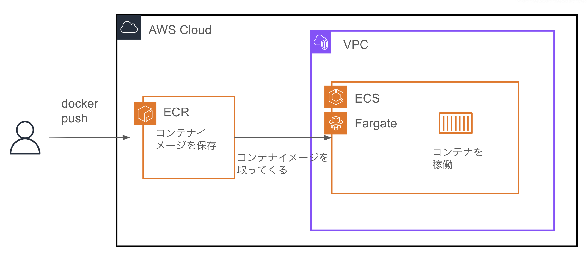

# ecs-terraform-handson

## Architecture


## How to use

`iac_learning`というプロファイルで`aws configure`を実行する。Regionは`ap-northeast-1`にする。

```shell
aws configure --profile
```

Terraformを実行する。

```shell
cd infra
terraform init
```

```shell
terraform apply -target=aws_route53_zone.root
```

```shell
terraform output ns
terraform output hosted_zone_id
```

出力をネームサーバーに設定する。
hosted_zone_idをterraform.tfvarsに記載する。

```shell
dig NS <YOUR DOMAIN> +short
```

```shell
terraform plan
terraform apply -auto-approve
```

イメージをERCにプッシュする。

```shell
# cd to root dir
cd ..
sh push_image.sh
```

## Clean up

```shell
terraform destroy -auto-approve
```
